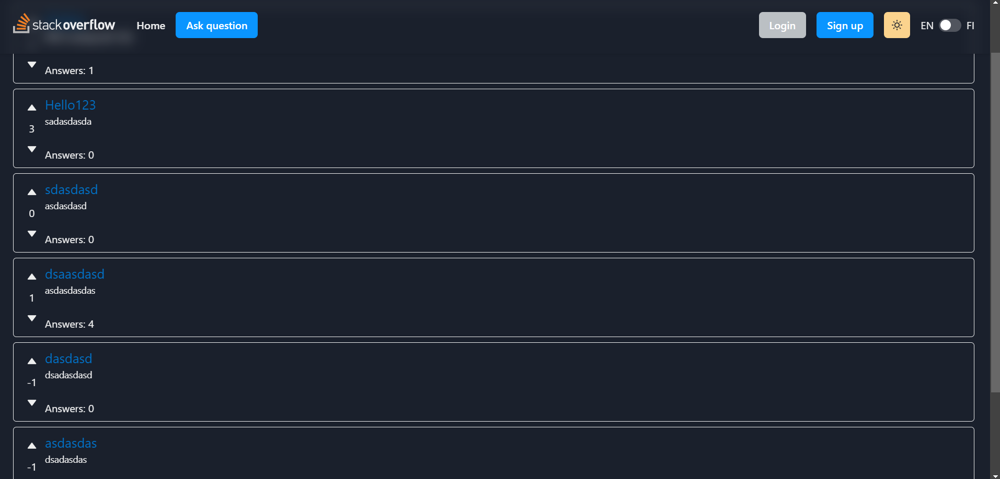

# Stackoverflow project



## Technologies

- [React](https://reactjs.org/) - React for the frontend
- [Chakra](https://chakra-ui.com/) - Component library for React, good theme and responsiveness support
- [MongoDB](https://www.mongodb.com/atlas/database) - NoSQL database, easy to use
- [Axios](https://axios-http.com/docs/intro) - Simpler HTTP request library
- [Framer Motion](https://www.framer.com/motion/) - Animations for React
- [Jest](https://jestjs.io/) - For frontend/backend testing
- [Supertest](https://www.npmjs.com/package/supertest) - For HTTP testing

## Installation

1. Git clone to an empty folder

```
git clone https://github.com/Haksa6/stackoverflow-copy-project.git
```

2. Cd into to the stackoverflow-copy-project and run npm install

```
npm install
```

3. Create a new file called .env in the server folder. Add the values as such:

```
PORT=5000
JWT_SECRET=SECRET
MONGODB_URI=your mongodb address such as mongodb://localhost:27017/
TESTDB_URI=database for testing such as mongodb://localhost:27017/testdb
NODE_ENV=test/development depending which database you wanna use you can also set this in the script in package.json
```

You can change the values to your own liking

4. Run npm run dev:client in the root folder to start the frontend

```
npm run dev:client
```

5. Run npm run dev:server in the root folder to start the backend

```
npm run dev:server
```

Remember to change the mongodb address to your own in the server index.js file

## User manual

Client:

```
    ├── services                    # all the calls to backend using axios
    ├── components                  # all the components to structure the app
    ├── CurrentUserContext.js       # set the context so current user can be called anywhere with useContext
    ├── i18n.js                     # the language setup file
    └── setupProxy.js               # set the proxy so we can use different ports for backend and frontend

```

Server:

```
    ├── utils                       # utils functions used as
    ├── models                      # mongodb models
    ├── routes                      # all the calls to backend
    ├── __tests__                   # all the tests
    ├── app.js                      # all the necessary packages to start backend and mongodb which index.js utilizes
    └── index.js                    # the basic file to start the backend
```

## Features

| Features                                                         | Max points |
| ---------------------------------------------------------------- | :--------: |
| Basic features                                                   |     25     |
| Utilization of a frontside framework (React)                     |     5      |
| Own feature (Light/ Dark theme makes the website customizable)   |     5      |
| Vote (up or down) posts and comments (only one vote per user)    |     3      |
| Own feature (Clean and responsive UI helps user navigate easier) |     5      |
| Own feature (404 page makes the website more responsive)         |     1      |
| Translation of the whole UI in two or more languages             |     2      |
| **Total score**                                                  |   **46**   |
